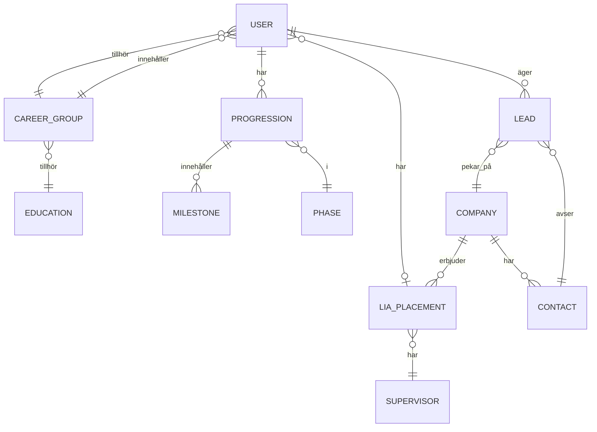
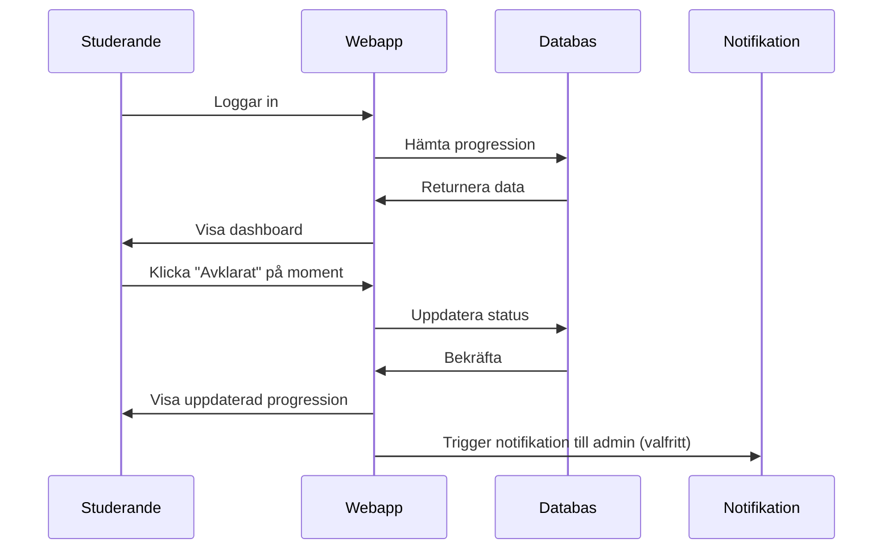
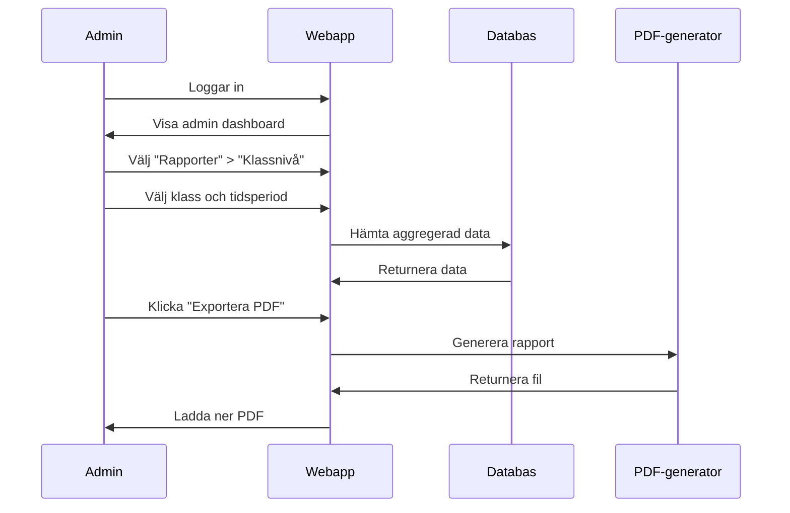

# Product Requirements Document (PRD)
## ChasCareer Uppföljningswebapp

| Attribut | Värde |
|----------|-------|
| **Version** | 1.0 |
| **Status** | Draft |
| **Datum** | 2025-12-22 |
| **Ägare** | Chas Academy |

---

## 1. Produktvision

> **Digitalisera och effektivisera uppföljningen av studerandes process genom Chas Career – minska manuell administration och skapa bättre stöd för både studerande och personal.**

---

## 2. Målgrupp

| Användartyp | Beskrivning | Antal |
|-------------|-------------|-------|
| **Studerande** | YH-studerande på Chas Academy | ~200/år |
| **Backoffice/Admin** | Karriär- och studiesamordnare, Programansvariga | 5-10 |
| **Utbildare** | Lärare och handledare | 10-20 |

---

## 3. Problemställning

### Nuläge
- Manuell uppföljning utan centralt system
- Svårt att få överblick över alla studerandes progression
- Ingen central databas för företag och LIA-platser
- Kommunikation sker via flera kanaler (Slack, mejl, Canvas)
- Tidskrävande att generera rapporter

### Önskat läge
- Automatiserad uppföljning i en webapp
- Realtidsöverblick för alla användare
- Central företagsdatabas med historik
- Integrerad kommunikation och påminnelser
- Rapporter genereras med ett klick

---

## 4. User Stories

### Studerande

| ID | User Story | Prioritet |
|----|------------|-----------|
| S1 | Som studerande vill jag se min progression genom faserna | Must |
| S2 | Som studerande vill jag markera avklarade moment | Must |
| S3 | Som studerande vill jag se kommande deadlines | Must |
| S4 | Som studerande vill jag kommunicera med Backoffice | Should |
| S5 | Som studerande vill jag spåra mina leads och kontakter | Should |
| S6 | Som studerande vill jag få automatiska påminnelser | Should |

### Backoffice/Admin

| ID | User Story | Prioritet |
|----|------------|-----------|
| A1 | Som admin vill jag se överblick över alla studerande | Must |
| A2 | Som admin vill jag filtrera på grupp, fas och status | Must |
| A3 | Som admin vill jag generera rapporter | Must |
| A4 | Som admin vill jag hantera företagsdatabasen | Should |
| A5 | Som admin vill jag skicka påminnelser till grupper | Should |
| A6 | Som admin vill jag kvalitetssäkra LIA-platser | Should |
| A7 | Som admin vill jag exportera data till PDF/Excel | Should |

### Utbildare

| ID | User Story | Prioritet |
|----|------------|-----------|
| U1 | Som utbildare vill jag se mina gruppers progression | Must |
| U2 | Som utbildare vill jag lämna feedback på studerande | Should |
| U3 | Som utbildare vill jag se statistik för min utbildning | Could |

---

## 5. Funktionella Krav

### 5.1 Användarhantering

| Krav-ID | Beskrivning | Prioritet |
|---------|-------------|-----------|
| F-AUTH-01 | Säker inloggning (OAuth/SSO) | Must |
| F-AUTH-02 | Tre användarroller med olika behörigheter | Must |
| F-AUTH-03 | Rollbaserad åtkomstkontroll | Must |
| F-AUTH-04 | Integration med befintligt inloggningssystem | Should |

### 5.2 Dashboard

| Krav-ID | Beskrivning | Prioritet |
|---------|-------------|-----------|
| F-DASH-01 | Admin: Översikt alla studerande | Must |
| F-DASH-02 | Admin: Filtrering per grupp/fas/status | Must |
| F-DASH-03 | Admin: Sökfunktion | Must |
| F-DASH-04 | Studerande: Personlig progressionsvy | Must |
| F-DASH-05 | Utbildare: Gruppöversikt | Should |

### 5.3 Processuppföljning

| Krav-ID | Beskrivning | Prioritet |
|---------|-------------|-----------|
| F-PROC-01 | Visualisering av FAS 1-4 | Must |
| F-PROC-02 | Markera avklarade moment | Must |
| F-PROC-03 | Kommentarer på moment | Should |
| F-PROC-04 | Automatiska påminnelser | Should |
| F-PROC-05 | Spårning av mål (leads, kontakter) | Should |

### 5.4 Företagsdatabas

| Krav-ID | Beskrivning | Prioritet |
|---------|-------------|-----------|
| F-DB-01 | CRUD för företag | Should |
| F-DB-02 | CRUD för kontakter | Should |
| F-DB-03 | CRUD för LIA-platser | Should |
| F-DB-04 | Sök och filtrering | Should |
| F-DB-05 | Historik över tidigare LIA-studerande | Could |

### 5.5 Rapportering

| Krav-ID | Beskrivning | Prioritet |
|---------|-------------|-----------|
| F-REP-01 | Rapport på individnivå | Should |
| F-REP-02 | Rapport på gruppnivå | Should |
| F-REP-03 | Rapport på klassnivå | Should |
| F-REP-04 | Export till PDF | Should |
| F-REP-05 | Export till Excel | Could |

### 5.6 Kommunikation

| Krav-ID | Beskrivning | Prioritet |
|---------|-------------|-----------|
| F-COM-01 | Meddelandefunktion i appen | Could |
| F-COM-02 | Notifikationer vid events | Should |
| F-COM-03 | Slack-integration | Should |

### 5.7 Integrationer

| Krav-ID | Beskrivning | Prioritet |
|---------|-------------|-----------|
| F-INT-01 | Slack: Notifikationer | Should |
| F-INT-02 | Canvas: Import studentdata | Could |
| F-INT-03 | Dataexport: CSV/Excel (för backup) | Could |

---

## 6. Icke-funktionella Krav

### 6.1 Prestanda

| Krav-ID | Beskrivning | Mål |
|---------|-------------|-----|
| NF-PERF-01 | Sidladdningstid | < 2 sekunder |
| NF-PERF-02 | Samtidiga användare | 200+ |
| NF-PERF-03 | Databassökning | < 1 sekund |

### 6.2 Säkerhet

| Krav-ID | Beskrivning |
|---------|-------------|
| NF-SEC-01 | GDPR-efterlevnad |
| NF-SEC-02 | Krypterad dataöverföring (HTTPS) |
| NF-SEC-03 | Krypterad datalagring |
| NF-SEC-04 | Loggning av känsliga handlingar |

### 6.3 Användbarhet

| Krav-ID | Beskrivning |
|---------|-------------|
| NF-USE-01 | Responsiv design (mobil, tablet, desktop) |
| NF-USE-02 | WCAG 2.1 AA tillgänglighet |
| NF-USE-03 | Intuitivt gränssnitt |

### 6.4 Skalbarhet

| Krav-ID | Beskrivning |
|---------|-------------|
| NF-SCA-01 | Stödja flera klasser och årskullar |
| NF-SCA-02 | Modulär arkitektur för framtida tillägg |

---

## 7. Datamodell

### Entiteter

| Entitet | Nyckelattribut |
|---------|----------------|
| **User** | id, name, email, role, career_group_id |
| **Career_Group** | id, name, region, education_id |
| **Progression** | id, user_id, phase_id, status |
| **Milestone** | id, name, phase_id, deadline |
| **Phase** | id, name (FAS 1-4), goals |
| **Company** | id, name, industry, city, website |
| **Contact** | id, name, title, company_id, phone, email |
| **LIA_Placement** | id, company_id, user_id, supervisor_id, period |
| **Lead** | id, user_id, company_id, contact_id, status |

---

## 8. Användarflöden

### 8.1 Studerande: Markera moment

### 8.2 Admin: Generera rapport

---

## 9. UI/UX Riktlinjer

### Designprinciper
1. **Enkelhet** – Minimalt antal klick för vanliga uppgifter
2. **Tydlighet** – Klar visuell hierarki och läsbarhet
3. **Konsistens** – Enhetliga mönster och komponenter
4. **Feedback** – Tydliga bekräftelser och felmeddelanden

### Färgschema (förslag)
| Användning | Färg |
|------------|------|
| Primär | #2563EB (blå) |
| Sekundär | #10B981 (grön) |
| Varning | #F59E0B (gul) |
| Fel | #EF4444 (röd) |
| Bakgrund | #F9FAFB (ljusgrå) |

---

## 10. KPIs & Mätetal

| KPI | Mål | Mätmetod |
|-----|-----|----------|
| Administrativ tid per elev | -50% | Tidsstudie före/efter |
| Faser slutförda i tid | 90% | Systemdata |
| Användarnöjdhet | 4/5+ | NPS-enkät |
| Påminnelser åtgärdade | 95% | Systemlogg |
| LIA säkrad före deadline | 95% | Registreringsdata |
| Daglig användning (DAU) | 60%+ | Analytics |

---

## 11. Acceptanskriterier

### MVP (Must-have för lansering)

- [ ] Användarhantering med 3 roller fungerar
- [ ] Admin kan se överblick och filtrera studerande
- [ ] Studerande kan se och uppdatera sin progression
- [ ] Automatiska påminnelser fungerar
- [ ] Responsiv design på alla enheter
- [ ] GDPR-efterlevnad verifierad

### V1.0 (Should-have)

- [ ] Företagsdatabas med full CRUD
- [ ] Rapporter kan genereras och exporteras
- [ ] Slack-integration fungerar
- [ ] CRM-modulen fungerar i databasen

---

## 12. Framtida Funktioner (V2.0+)

| Funktion | Beskrivning |
|----------|-------------|
| AI-assistans | Förslag på leads baserat på profil |
| Canvas-sync | Automatisk import av studentdata |
| Matchmaking | Automatisk matchning studerande-företag |
| Gamification | Poäng och badges för aktivitet |
| Mobile app | Native iOS/Android-app |

---

## 13. Godkännanden

| Roll | Namn | Datum | Signatur |
|------|------|-------|----------|
| Product Owner | | | |
| Tech Lead | | | |
| Stakeholder | | | |
