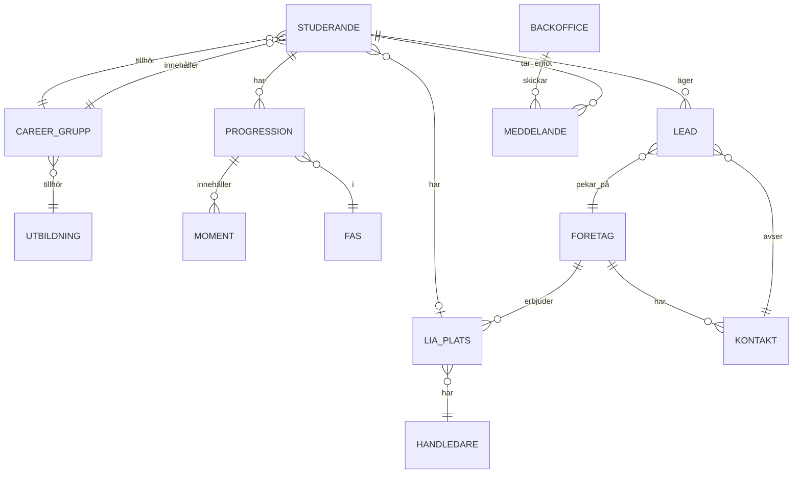

# Kravspecifikation: ChasCareer

## Projektöversikt

**ChasCareer** är ett karriärprogram som löper parallellt med Chas Academys YH-utbildningar. Programmet fokuserar på att utveckla studerandes mjuka kompetenser (soft skills) och stödja dem hela vägen från utbildningsstart till anställning inom IT-branschen.

> [!IMPORTANT]
> Programmets slutmål: **Alla studerande ska få jobb inom IT-branschen efter examen** – antingen i samband med examen eller senast 6 månader därefter.

---

## Programmets Struktur

### Fyra Faser

| Fas | Fokus | Tidsperiod |
|-----|-------|------------|
| **FAS 1: Intro** | Bygga grund, CV, LinkedIn, Research | Sept–Nov |
| **FAS 2: Nätverkande** | Studiebesök, kontakter, personligt varumärke | Nov–Mar |
| **FAS 3: LIA-sök** | Aktivt sökande, intervjuer | Apr–Okt |
| **FAS 4: Jobb-sök** | LIA-period + jobbsök | Nov–Jun (+4 mån) |

---

## FAS 1: Intro

### Syfte
- Bygga stabil grund på grupp- och individnivå
- Skapa struktur, förståelse och arbetsmetod som bär genom programmet
- Alla arbetar som **researchers** och fyller gemensamt CRM

### Huvudaktiviteter

#### Career Workshop 1: CV & LinkedIn
- Peer review i smågrupper
- Feedback på CV (design- och ATS-version)
- LinkedIn-profilering och verktygsträning

#### Career Workshop 2: Dream Big & Deep Research
- Utforska IT-branschens möjligheter
- Lära sig hitta kvalitativa leads
- Deep research-tekniker

#### Big Bang Day (slutet av FAS 1)
- Fysiskt event på Scandic Hotel
- Signering av Commitment-avtal
- Rollfördelning i Career-gruppen
- Teambuilding och middag

### CRM-system
- **Definition**: Customer Relationship Management för att hålla ordning på leads och kontakter
- **Format**: Inbyggd databasmodul i ChasCareer-webappen
- **Fält inkluderar**: Inmatad datum, Researcher, Kommunikatör, Företag, Kontaktperson, Titel, Telefon, Mejl, Kontaktförsök, Utfall, Anteckningar

### Mål FAS 1
| Nivå | Mål |
|------|-----|
| **Grupp** | Minst 30 leads i CRM före Big Bang Day |
| **Individ** | Två CV-versioner (design + ATS) + LinkedIn-profil |

---

## FAS 2: Nätverkande

### Syfte
- Nå ut till branschen och bygga kontaktnät
- Fördjupad rollfördelning och balanserat arbete
- Skapa gränsytor till arbetslivet

### Roller i Career-gruppen

| Roll | Ansvar |
|------|--------|
| **Projektledare** | Håller ihop gruppen, leder möten, skapar gemenskap |
| **Researchers** (2-3 st) | Hitta leads, uppdatera CRM, tipsa om event |
| **Kommunikatörer** (3-4 st) | Kontakta företag, boka studiebesök, följa upp dialoger |

### Huvudaktiviteter

#### Studiebesök
- Max 3-4 studerande per besök (för att bli ihågkomna)
- Relationellt syfte, inte bara informativt
- Adda kontakter på LinkedIn efteråt
- Skriv tack-inlägg på LinkedIn med hashtags

#### Chas Meetups
- Nätverksevent för företag i städer med studerande
- Matchmaking mellan studerande och företag
- Tävling: grupp som lockar flest företag vinner pris

#### Career Workshop 3: Pitcha dig själv & How 2 mingle
- Hisspitch (max 60 sekunder)
- Mingelteknik och isbrytare
- Kroppsspråk och icke-verbal kommunikation

### LinkedIn-aktivitet
- Adda kontakter från IRL-möten
- Tack-inlägg efter studiebesök
- Hashtags: #ChasCareer #ChasAcademy

### Mål FAS 2
| Nivå | Mål |
|------|-----|
| **Grupp** | 90 leads i CRM, 10 studiebesök, 1 tech-event |
| **Individ** | 5 studiebesök, 5 egna IT-kontakter |

---

## FAS 3: LIA-sök

### Syfte
- Säkerställa kvalitativ LIA-plats före kursstart
- Individuellt arbete i fem sprintar
- Alla deltar oavsett tidigare aktivitet i ChasCareer

### LIA-period
- **Datum**: 10 november 2025 – 26 april 2026
- **Hard Deadline**: Sista september

### Stödstrukturer

#### LIA Check-ins (3 st)
| Check-in | Tidpunkt | Fokus |
|----------|----------|-------|
| 1 | Maj | Aktivitet och struktur |
| 2 | Juni | Progression |
| 3 | Augusti | Resultat före deadline |

#### LIA-sökstugor
- **Våren (april-maj)**: Digitala, fredagar 09-12 via Zoom
- **Hösten (aug-sept)**: Fysiska på Scandic/Globen, drop-in 09-17

#### Career Workshop 4: Arbetsintervju & Arbetsprov
- Intervjuteknik och vanliga frågor
- Arbetsprov (kod, design, säkerhet)
- AI-genererade övningsuppgifter

### LIA-registrering
- Registrera i skolans system för kvalitetskontroll
- Principen "Regga första bästa"
- Fortsätt söka och byt upp dig om bättre finns

### Vid utebliven LIA
- Placering på tillgängligt företag i oktober
- Uppfyller kvalitetskrav men ej optimal

### Mål FAS 3
| Nivå | Mål |
|------|-----|
| **Grupp** | Inga gruppmål |
| **Individ** | 60 leads i individuellt CRM, 10 IT-kontakter, LIA före sept |

---

## FAS 4: Jobb-sök

### Syfte
- Jobb i samband med examen (eller inom 6 mån efter)
- Systematiskt jobbsök parallellt med LIA
- Använda examensarbetet som språngbräda

### Tidsperioder
1. **LIA-perioden (nov-apr)**: Jobbsök kvällstid parallellt
2. **Examensarbetet (maj-jun)**: Intensivt jobbsök dagtid
3. **Efterdyning (sept)**: Alumni Reunion

### Stödstrukturer

#### Jobb Check-in
- En gång, när studerande kommer tillbaka från LIA
- Avstämning av progression i helklass

#### Jobb-sökstugor
- **LIA-perioden**: 6 kvällsstugor, måndagar 17-20
- **Examensarbetet**: 2 dagstugor, fredagar 13-16

### Chas Alumni-nätverk
- LinkedIn-grupp för examinerade
- Möjlighet till ledningsgrupp, Chas Talks, jury
- Direktlänk till jobbtips och karriärmöjligheter

### 15 Budord för Jobbsök
1. Sätt tydliga mål
2. Prioritera kvalitet
3. Jobba i block
4. Utnyttja befintligt nätverk
5. Kontakta familj/vänner
6. Var aktiv på LinkedIn
7. Research före ansökan
8. Förbered intervjuer
9. Var transparent om jobbsök
10. Dokumentera allt i CRM
11. Sätt NEJ som delmål
12. Intala dig att det är kul
13. Be om feedback
14. Ta hand om dig
15. Ge inte upp

### Mål FAS 4
| Nivå | Mål |
|------|-----|
| **Grupp** | Inga gruppmål |
| **Individ** | 90 leads, 15 IT-kontakter, Anställning vid examen (eller inom 6 mån) |

---

## Organisation & Roller

### Backoffice
| Roll | Typ | Ansvar |
|------|-----|--------|
| **Programansvarig (PA)** | Strategisk | Övergripande process, branschdialog, kvalitetssäkring |
| **Karriär- och studiesamordnare (KS)** | Operativ (hög) | Coaching, workshops, feedback, rapporterar till PA |
| **Utbildare** | Operativ (låg) | Stöd i klassrum, balans studier/karriär |

### Career-grupper
- 6-8 studerande från olika utbildningar i samma region
- Blandade kompetenser medvetet
- Aktiva under FAS 1-2, upplöses därefter

---

## Teoretisk Grund

### Emergent Leadership
- Ledarskap växer fram naturligt, tilldelas ej
- Projektledare utses demokratiskt efter Big Bang Day
- Växlande ledarskap beroende på kompetensområde

### Tuckmans Gruppdynamik
| Fas | Tuckman-stadie | Chas Career-aktivitet |
|-----|----------------|----------------------|
| FAS 1 | Forming | Commitmentavtal signeras |
| FAS 2 | Storming/Norming | Roller och rutiner etableras |
| FAS 2+ | Performing | Gruppen fungerar självständigt |

---

## Kommunikationspolicy

### Kanaler
| Kommunikation | Kanal |
|---------------|-------|
| Studerande ↔ Studerande | Slack (ej Discord!) |
| Studerande → Backoffice | Mejl till KS |
| Backoffice → Alla | Slack: Chas-extended |
| Backoffice → Career-grupp | Respektive grupps Slack-kanal |
| Backoffice → Individ (LIA-fas) | Slack DM |

### Frågehierarki
1. Career-gruppens kanal
2. Boiler-team
3. Klasskanal
4. Mejl till KS

---

## Commitment-avtal

### Deltagarens Åtaganden
- 4-5 timmar/vecka för ChasCareer
- Komma förberedd till möten
- Visa förståelse för andras prioriteringar
- Kompensera vid utebliven aktivitet

### Roller-specifikt Ansvar
Se rolltabellen ovan (Projektledare, Researcher, Kommunikatör)

### Konsekvenser
| Tidigare | Påföljd |
|----------|---------|
| **Första inaktivitet** | Varning + åtgärdsplan |
| **Upprepade/ej åtgärd** | Förlorar plats i programmet |
| **Olämpligt uppförande** | Varning → borttagen vid grov/upprepad |

---

## Viktiga Datum & Events

| Event | Beskrivning |
|-------|-------------|
| **Big Bang Day** | Fysisk milstolpe, signering, teambuilding |
| **Career Workshops 1-4** | Praktiska workshops genom programmet |
| **Chas Meetups** | Nätverksevent med företag |
| **LIA Check-ins** | Digitala avstämningar klassvis |
| **Sökstugor** | Fokuserade arbetspass (digitala/fysiska) |
| **Alumni Reunion** | Träff 4 månader efter examen |

---

## Tekniska Verktyg & Resurser

| Verktyg | Användning |
|---------|------------|
| **Canvas** | Kursmaterial, inlämningar, kalender |
| **ChasCareer Webapp** | CRM, lead-hantering, progression |
| **Slack** | Intern kommunikation |
| **LinkedIn** | Nätverkande, synlighet |
| **Zoom** | Digitala möten och sökstugor |

### Lead-källor (urval)
- Allabolag, Proff, Bolagsverket
- Crunchbase, The Hub, LinkedIn Jobs
- Lokala Science Parks och inkubatorer
- Myndigheten för Yrkeshögskolans webkurs för handledare

---

## Framgångsmått

### Progression genom Programmet

### Slutmål
- **Primärt**: Anställning inom IT vid examen
- **Sekundärt**: Anställning inom 6 månader efter examen
- **CSN-krav**: Godkända kurser i utbildningsprogrammet

---

## Sammanfattning

ChasCareer är ett strukturerat karriärprogram som:

1. **Bygger mjuka kompetenser** genom praktiska workshops och verkliga nätverkssituationer
2. **Skapar systematik** med CRM, deadlines och mätbara mål
3. **Stöttar gemensamt arbete** genom Career-grupper och peer learning
4. **Förbereder för arbetslivet** genom studiebesök, intervjuträning och branschkontakter
5. **Säkerställer LIA och jobb** genom aktiv coachning och stödstrukturer

> [!TIP]
> Programmet speglar moderna IT-arbetsplatser med platt struktur, gemensamt ansvar och flytande roller.

---

# DEL 2: Webapplikation – ChasCareer Uppföljningswebapp

## Produktöversikt

### Syfte
Skapa en modern webbapplikation som **digitaliserar och effektiviserar hela Chas Career-processen** beskriven i Del 1. Appen ersätter alla manuella verktyg (kalkylark, separata listor, manuell uppföljning) med ett enhetligt, realtidsbaserat system.

> [!IMPORTANT]
> **Kärnprincip**: Allt arbete som idag görs manuellt inom Chas Career ska kunna hanteras snabbare, enklare och med bättre överblick i denna webapp.

### Mål
- **Eliminera manuellt arbete**: Automatisera uppföljning, påminnelser och rapportering
- **Central datakälla**: All data (studerande, företag, leads, LIA-platser) i en databas
- **Realtidsöverblick**: Dashboards för alla roller med live-data
- **Effektivisera kommunikation**: Integrerade notifikationer och Slack-koppling
- **Stödja hela processen**: Från FAS 1 research till FAS 4 jobb-sök och alumni
- Centralisera data om företag, LIA-platser och kontakter

---

## Funktionella Krav

### Användarhantering

| Roll | Behörigheter |
|------|--------------|
| **Studerande** | Se egen process, markera moment, kommunicera med Backoffice |
| **Backoffice/Admin** | Full överblick, rapporter, hantera användare, skicka påminnelser |
| **Utbildare** | Följa upp grupper, lämna feedback, se statistik |

- Säker autentisering (OAuth/SSO)
- Rollbaserad åtkomstkontroll

### Dashboard

**Funktioner:**
- Översikt över alla studerandes progression (fas, status, aktiviteter)
- Filtrering och sökning på grupper, individer, faser och status
- Personlig vy för studerande

### Processuppföljning

- Visualisering av varje studerandes process genom FAS 1–4
- Markera avklarade moment (workshops, studiebesök, check-ins)
- Lämna kommentarer och feedback
- Automatiska påminnelser för deadlines och viktiga datum
- Spårning av mål: leads, kontakter, studiebesök

### Företagsdatabas

> [!IMPORTANT]
> Central databas för företag, LIA-platser och kontakter – tillgänglig för alla användare.

| Datatyp | Fält |
|---------|------|
| **Företag** | Namn, bransch, stad, storlek, webbplats, kontakthistorik |
| **LIA-platser** | Företag, handledare, period, studerande, status, feedback |
| **Kontakter** | Namn, titel, företag, telefon, mejl, LinkedIn, senaste kontakt |

**Funktioner:**
- Sök och filtrera företag efter stad, bransch, storlek
- Spåra vilka företag som tidigare haft LIA-studerande
- Dela leads mellan Career-grupper
- Kvalitetssäkring av LIA-platser

### Rapportering

- Generera rapporter på individ-, grupp- och klassnivå
- Export till PDF/Excel
- Statistik: antal leads, kontakter, studiebesök, LIA-status
- Trendanalys över tid

### Kommunikation

- Meddelandefunktion mellan studerande och Backoffice
- Notifieringar vid viktiga händelser eller deadlines
- Integration med Slack för kommunikation

### Integrationer

| System | Integrationstyp |
|--------|-----------------|
| **Slack** | Notifieringar, påminnelser, direktmeddelanden |
| **Canvas** | Import av student- och kursdata |
| **CRM (Inbyggd databas)** | Lead-hantering direkt i appen |
| **LinkedIn** | (Future) Profilverifiering |

---

## Icke-funktionella Krav

### Säkerhet & Efterlevnad
- **GDPR-efterlevnad**: Samtycke, dataportabilitet, rätt att bli glömd
- **Datasäkerhet**: Krypterad lagring och överföring (HTTPS, at-rest encryption)
- **Åtkomstkontroll**: Rollbaserad, loggning av känsliga handlingar

### Prestanda & Skalbarhet
- Hantera minst **200 samtidiga användare**
- Snabb laddningstid (<2 sekunder)
- Skalbart för flera klasser och årskullar

### Användbarhet
- **Responsiv design**: Mobil, surfplatta, desktop
- **Hög tillgänglighet**: WCAG 2.1 AA-standarder
- **Intuitivt gränssnitt**: Minimal inlärningskurva

---

## Användarflöden

### Studerande

### Backoffice/Administratör

### Utbildare

1. Loggar in
2. Ser översikt över sina grupper
3. Lämnar feedback på studerandes progression
4. Ser statistik för sin utbildning

---

## KPIs (Mätetal)

| KPI | Mål | Mätmetod |
|-----|-----|----------|
| **Administrativ tid per elev** | Minskning med 50% | Tidsstudie före/efter |
| **Faser slutförda i tid** | 90% av studerande | Systemdata |
| **Användarnöjdhet** | 4/5 eller högre | Användareenkäter |
| **Påminnelser** | 95% åtgärdade före deadline | Systemlogg |
| **LIA säkrad före deadline** | 95% | Registreringsdata |

---

## Acceptanskriterier

### Tekniska
- [ ] Systemet hanterar 200+ samtidiga användare utan prestandaförlust
- [ ] Alla data lagras säkert och krypterat
- [ ] Rollbaserad åtkomst fungerar korrekt
- [ ] Responsiv design fungerar på alla skärmstorlekar
- [ ] Integration med Slack fungerar

### Användarupplevelse
- [ ] 90% av användarna upplever bättre överblick (enkät)
- [ ] Studerande kan självständigt navigera och uppdatera sin process
- [ ] Backoffice kan generera rapporter inom 3 klick
- [ ] Automatiska påminnelser skickas 7 dagar före deadline

### Data
- [ ] Företagsdatabasen sökning returnerar resultat inom 1 sekund
- [ ] CRM-modulen fungerar korrekt i databasen
- [ ] Export till PDF/Excel fungerar korrekt

---

## Datamodell (Översikt)

---

## Teknisk Stack (Modern 2025)

| Komponent | Teknologi | Motivering |
|-----------|-----------|------------|
| **Framework** | Next.js 15 (App Router) | Server Components, streaming, optimal DX |
| **Språk** | TypeScript | Typsäkerhet, bättre utvecklarupplevelse |
| **Styling** | Tailwind CSS + shadcn/ui | Modern, snabb, tillgängliga komponenter |
| **Databas** | PostgreSQL (via Supabase) | Relationsdata, row-level security, realtime |
| **ORM** | Prisma / Drizzle | Typsäkra queries, migrations |
| **Autentisering** | Clerk / NextAuth.js v5 | Färdig användarhantering, SSO-stöd |
| **State** | TanStack Query | Server state, caching, optimistic updates |
| **Forms** | React Hook Form + Zod | Validering, typsäkerhet |
| **Tabeller** | TanStack Table | Filtrering, sortering, pagination |
| **Charts** | Recharts / Tremor | Dashboards, statistik |
| **PDF** | React-PDF / Puppeteer | Rapportgenerering |
| **Email** | Resend | Transaktionsmail, påminnelser |
| **Hosting** | Vercel | Edge functions, automatic scaling |
| **Monitoring** | Sentry | Felspårning, prestanda |
| **Analytics** | PostHog / Plausible | Användaranalys, GDPR-vänligt |

---

## Vad Appen Ersätter/Effektiviserar

| Nuvarande process | Ny lösning i appen |
|-------------------|--------------------|
| CRM i Google Sheets | Inbyggd CRM-modul med leads, kontakter, företag |
| Manuell uppföljning av progression | Automatisk spårning per fas med visuell timeline |
| Excel-listor för LIA-platser | Databas med LIA-platser, handledare, status |
| Manuella påminnelser via Slack/mejl | Automatiska påminnelser baserat på deadlines |
| Rapporter skapas manuellt | Generera rapporter med ett klick (PDF/Excel) |
| Spridd kommunikation | Centraliserade meddelanden + Slack-integration |
| Ingen historik | Full historik över alla kontakter och beslut |
| Svårt få överblick | Realtidsdashboards per roll |

---

## Roadmap

| Fas | Leverans | Fokus |
|-----|----------|-------|
| **MVP** | Användarhantering, Dashboard, Processuppföljning | Kärnflödet fungerar |
| **V1.0** | CRM-modul, Företagsdatabas, LIA-hantering | Ersätta kalkylark |
| **V1.1** | Rapportering (PDF/Excel), Slack-integration | Automation |
| **V1.5** | Canvas-integration, Avancerad statistik | Datadrivna beslut |
| **V2.0** | AI-assistans, Smart matchning, Gamification | Innovation |
