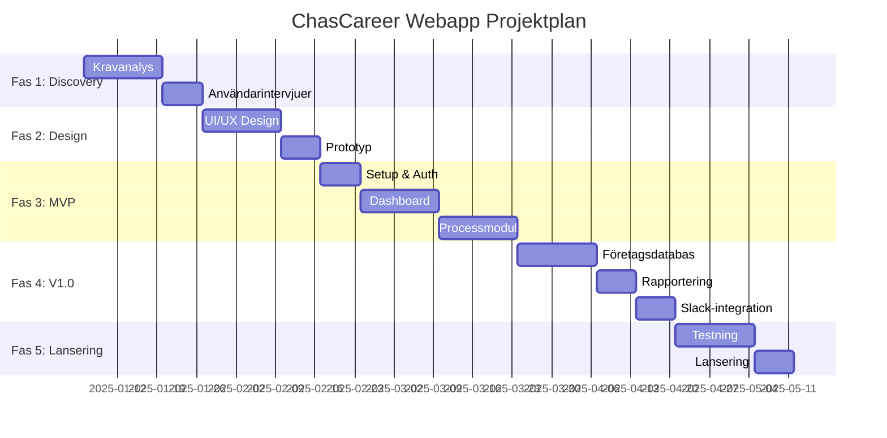

# ChasCareer Uppföljningswebapp – Projektplan

## Projektöversikt

| Attribut | Värde |
|----------|-------|
| **Projektnamn** | ChasCareer Uppföljningswebapp |
| **Version** | 1.0 |
| **Skapad** | 2025-12-22 |
| **Syfte** | Digitalisera uppföljning av studerandes Chas Career-progression |

---

## Fasöversikt

---

## Fas 1: Discovery & Kravanalys (3 veckor)

### Mål
- Validera och förfina krav från PRD
- Förstå användarnas behov på djupet
- Definiera MVP-scope

### Aktiviteter

| # | Aktivitet | Ansvarig | Tid | Status |
|---|-----------|----------|-----|--------|
| 1.1 | Granska befintlig dokumentation | PO | 2d | ☐ |
| 1.2 | Intervjua Backoffice (3-4 pers) | PO | 3d | ☐ |
| 1.3 | Intervjua utbildare (2-3 pers) | PO | 2d | ☐ |
| 1.4 | Intervjua studerande (5-6 pers) | PO | 3d | ☐ |
| 1.5 | Analysera nuvarande CRM-data | Dev | 2d | ☐ |
| 1.6 | Kartlägga Canvas-integration | Dev | 1d | ☐ |
| 1.7 | Dokumentera user stories | PO | 3d | ☐ |
| 1.8 | Prioritera MVP-features | Team | 1d | ☐ |

### Leverabler
- [ ] Validerad kravspecifikation
- [ ] User stories (prioriterade)
- [ ] MVP-scope dokument
- [ ] Integrationsplan

---

## Fas 2: Design (3 veckor)

### Mål
- Skapa användarvänligt gränssnitt
- Validera design med användare
- Färdigställa klickbar prototyp

### Aktiviteter

| # | Aktivitet | Ansvarig | Tid | Status |
|---|-----------|----------|-----|--------|
| 2.1 | Skapa designsystem (färger, typsnitt) | Designer | 2d | ☐ |
| 2.2 | Wireframes: Dashboard (Admin) | Designer | 2d | ☐ |
| 2.3 | Wireframes: Dashboard (Studerande) | Designer | 2d | ☐ |
| 2.4 | Wireframes: Processvy | Designer | 2d | ☐ |
| 2.5 | Wireframes: Företagsdatabas | Designer | 2d | ☐ |
| 2.6 | Hi-fi mockups | Designer | 5d | ☐ |
| 2.7 | Klickbar prototyp (Figma) | Designer | 3d | ☐ |
| 2.8 | Användartester (3-5 pers) | PO | 2d | ☐ |
| 2.9 | Iterera baserat på feedback | Designer | 2d | ☐ |

### Leverabler
- [ ] Designsystem
- [ ] Wireframes för alla vyer
- [ ] Hi-fi mockups
- [ ] Klickbar prototyp
- [ ] Användartest-rapport

---

## Fas 3: MVP-utveckling (5 veckor)

### Mål
- Fungerande app med kärnfunktionalitet
- Användarhantering och autentisering
- Dashboard och processuppföljning

### Sprint 1: Setup & Autentisering (1 vecka)

| # | Aktivitet | Tid | Status |
|---|-----------|-----|--------|
| 3.1.1 | Sätta upp Next.js projekt | 4h | ☐ |
| 3.1.2 | Konfigurera databas (PostgreSQL/Supabase) | 4h | ☐ |
| 3.1.3 | Implementera autentisering (NextAuth) | 8h | ☐ |
| 3.1.4 | Skapa användarroller (Studerande, Admin, Utbildare) | 4h | ☐ |
| 3.1.5 | Sätta upp CI/CD pipeline | 4h | ☐ |
| 3.1.6 | Konfigurera staging-miljö | 4h | ☐ |

### Sprint 2-3: Dashboard (2 veckor)

| # | Aktivitet | Tid | Status |
|---|-----------|-----|--------|
| 3.2.1 | Layout och navigation | 8h | ☐ |
| 3.2.2 | Admin dashboard: Översikt | 16h | ☐ |
| 3.2.3 | Admin dashboard: Filtrering och sök | 12h | ☐ |
| 3.2.4 | Studerande dashboard: Min process | 16h | ☐ |
| 3.2.5 | Utbildare dashboard: Gruppöversikt | 8h | ☐ |
| 3.2.6 | Responsiv design | 8h | ☐ |
| 3.2.7 | Unit tests | 8h | ☐ |

### Sprint 4-5: Processmodul (2 veckor)

| # | Aktivitet | Tid | Status |
|---|-----------|-----|--------|
| 3.3.1 | Datamodell: Progression, Moment, Fas | 8h | ☐ |
| 3.3.2 | Visualisering av fas-progression | 16h | ☐ |
| 3.3.3 | Markera avklarade moment | 8h | ☐ |
| 3.3.4 | Kommentarer och feedback | 12h | ☐ |
| 3.3.5 | Automatiska påminnelser (cron) | 8h | ☐ |
| 3.3.6 | Notifikationssystem | 12h | ☐ |
| 3.3.7 | Integration tests | 8h | ☐ |

### MVP Leverabler
- [ ] Fungerande app i staging
- [ ] Användarhantering med 3 roller
- [ ] Admin- och studerandedashboard
- [ ] Processvisning med fas-spårning
- [ ] Grundläggande notifikationer

---

## Fas 4: V1.0 Features (4 veckor)

### Sprint 6-7: Företagsdatabas (2 veckor)

| # | Aktivitet | Tid | Status |
|---|-----------|-----|--------|
| 4.1.1 | Datamodell: Företag, Kontakt, LIA-plats | 8h | ☐ |
| 4.1.2 | CRUD för företag | 12h | ☐ |
| 4.1.3 | CRUD för kontakter | 8h | ☐ |
| 4.1.4 | CRUD för LIA-platser | 8h | ☐ |
| 4.1.5 | Sök och filtrering | 12h | ☐ |
| 4.1.6 | Koppla leads till studerande | 8h | ☐ |
| 4.1.7 | Inbyggd CRM-modul med leads | 12h | ☐ |

### Sprint 8: Rapportering (1 vecka)

| # | Aktivitet | Tid | Status |
|---|-----------|-----|--------|
| 4.2.1 | Rapport: Individnivå | 8h | ☐ |
| 4.2.2 | Rapport: Gruppnivå | 8h | ☐ |
| 4.2.3 | Rapport: Klassnivå | 8h | ☐ |
| 4.2.4 | Export PDF | 8h | ☐ |
| 4.2.5 | Export Excel | 4h | ☐ |

### Sprint 9: Slack-integration (1 vecka)

| # | Aktivitet | Tid | Status |
|---|-----------|-----|--------|
| 4.3.1 | Slack app setup | 4h | ☐ |
| 4.3.2 | Webhook för notifikationer | 8h | ☐ |
| 4.3.3 | Deadline-påminnelser till Slack | 8h | ☐ |
| 4.3.4 | DM till studerande | 8h | ☐ |
| 4.3.5 | Testning och dokumentation | 4h | ☐ |

### V1.0 Leverabler
- [ ] Komplett företagsdatabas
- [ ] LIA-platshantering
- [ ] Rapporter (PDF/Excel)
- [ ] Slack-integration

---

## Fas 5: Testning & Lansering (3 veckor)

### Sprint 10-11: Testning (2 veckor)

| # | Aktivitet | Tid | Status |
|---|-----------|-----|--------|
| 5.1.1 | End-to-end testning | 16h | ☐ |
| 5.1.2 | Prestandatestning (200 användare) | 8h | ☐ |
| 5.1.3 | Säkerhetstestning | 8h | ☐ |
| 5.1.4 | UAT med Backoffice | 8h | ☐ |
| 5.1.5 | UAT med studerande | 8h | ☐ |
| 5.1.6 | Bugfixar | 24h | ☐ |
| 5.1.7 | Dokumentation | 8h | ☐ |

### Sprint 12: Lansering (1 vecka)

| # | Aktivitet | Tid | Status |
|---|-----------|-----|--------|
| 5.2.1 | Produktionsmiljö setup | 8h | ☐ |
| 5.2.2 | Datamigrering | 8h | ☐ |
| 5.2.3 | Användarutbildning (Backoffice) | 4h | ☐ |
| 5.2.4 | Användarutbildning (Utbildare) | 2h | ☐ |
| 5.2.5 | Soft launch (en klass) | 4h | ☐ |
| 5.2.6 | Full lansering | 2h | ☐ |
| 5.2.7 | Övervaka och support | Löpande | ☐ |

---

## Riskhantering

| Risk | Sannolikhet | Konsekvens | Åtgärd |
|------|-------------|------------|--------|
| Scope creep | Hög | Hög | Strikt MVP, backlog för V2 |
| Canvas-integration komplex | Medium | Medium | Manuell import som backup |
| GDPR-compliance | Låg | Hög | Juridisk granskning tidigt |
| Dålig användaradoption | Medium | Hög | Involvera användare i design |
| Tekniska skulder | Medium | Medium | Code review, refactoring-sprint |

---

## Teamsammansättning (förslag)

| Roll | Antal | Allokering |
|------|-------|------------|
| Product Owner | 1 | 50% |
| UX Designer | 1 | 100% Fas 2, 25% därefter |
| Fullstack Developer | 2 | 100% |
| QA | 1 | 50% Fas 3-4, 100% Fas 5 |

---

## Budget & Resurser

| Resurs | Uppskattning |
|--------|--------------|
| **Utveckling** | ~600 timmar |
| **Design** | ~120 timmar |
| **Testning** | ~80 timmar |
| **Infrastruktur** | Vercel Pro, Supabase Pro |
| **Total tid** | ~18 veckor |

---

## Nästa steg

1. [ ] Godkänn projektplan
2. [ ] Säkra resurser
3. [ ] Kickoff-möte
4. [ ] Starta Fas 1: Discovery
